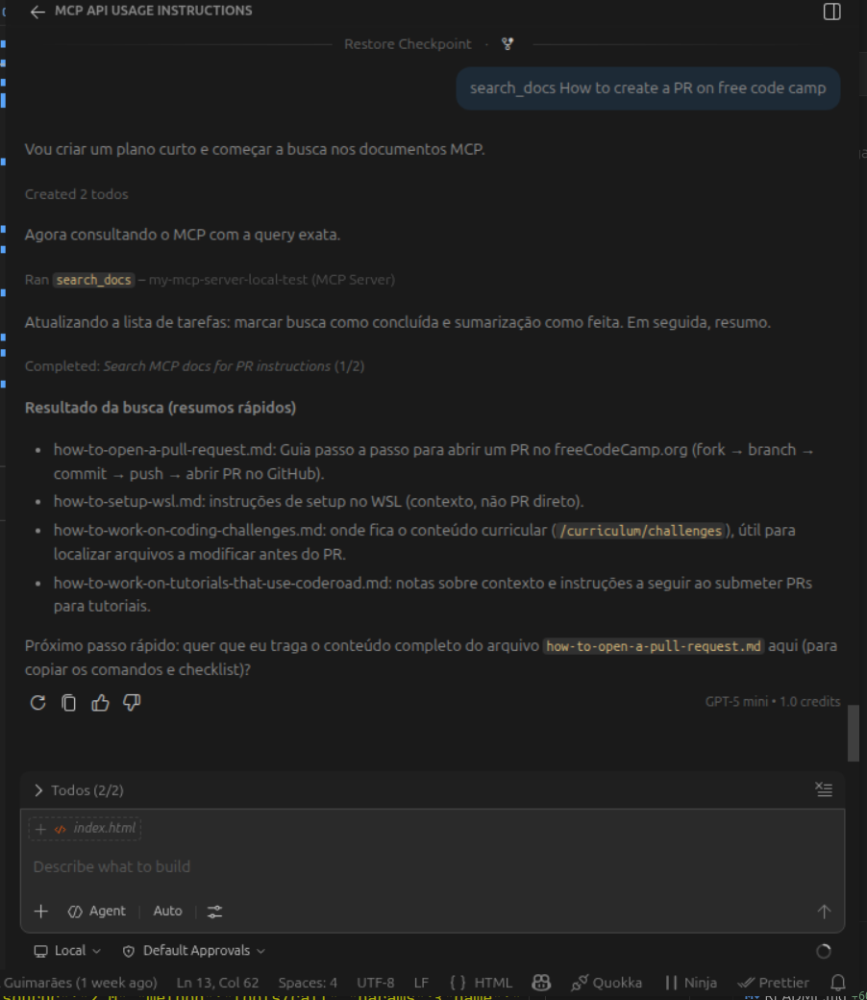
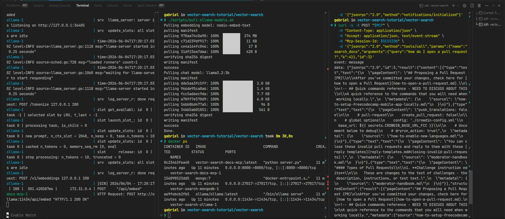

# Vector Search — RAG local (Python MCP + Ollama + MongoDB)

Servidor MCP que indexa a documentação do freeCodeCamp (`fcc_docs/`) e expõe busca vetorial + chat

| Tool | O que faz |
|------|-----------|
| `search_docs` | Retorna trechos relevantes (cosseno + MMR), sem LLM |
| `ask_about_docs` | Busca + resposta em markdown via Ollama chat |

## Pré-requisitos

- Docker e Docker Compose
- VS Code / Cursor com suporte a MCP (GitHub Copilot)

## Setup completo

Na pasta `vector-search`:

```bash
docker compose up -d
./scripts/pull-ollama-models.sh
# cria uma segunda instancia pra fazer o embed
docker compose run --rm docs-mcp python scripts/embed_docs.py
# ou executar na instancia rodando 
docker compose exec docs-mcp python scripts/embed_docs.py
```

O passo de indexação é obrigatório na primeira vez (e após trocar `OLLAMA_EMBED_MODEL` ou os arquivos em `fcc_docs/`).

### Modelos menores (CPU lenta)

```bash
export OLLAMA_CHAT_MODEL=phi3:mini
./scripts/pull-ollama-models.sh
docker compose run --rm docs-mcp python scripts/embed_docs.py
```

## Configurar no editor (Copilot)

1. `Ctrl+Shift+P` → **MCP: Add Server** (ou **MCP: Open User Configuration**).
2. Adicione um servidor HTTP: `http://localhost:8000/mcp`.

Exemplo em [`.vscode/mcp.json`](.vscode/mcp.json):

```json
{
  "servers": {
    "docs-mcp": {
      "url": "http://localhost:8000/mcp",
      "type": "http"
    }
  },
  "inputs": []
}
```

3. O painel MCP deve mostrar **Running** e as tools `search_docs` / `ask_about_docs`.
4. No chat do Copilot, por exemplo: *"Use ask_about_docs: How do I open a pull request?"*

## MCP rodando no Copilot



### Testando com curl



## Variáveis de ambiente

Copie [`.env.example`](.env.example) para `.env` se rodar fora do Compose.

| Variável | Default (host) | No Compose (`docs-mcp`) |
|----------|----------------|-------------------------|
| `MONGODB_URI` | `mongodb://localhost:27017` | `mongodb://mongodb:27017` |
| `OLLAMA_BASE_URL` | `http://localhost:11434` | `http://ollama:11434` |
| `OLLAMA_EMBED_MODEL` | `nomic-embed-text` | idem |
| `OLLAMA_CHAT_MODEL` | `llama3.2:3b` | idem |

## Como o Copilot usa

1. Conecta em `http://localhost:8000/mcp`.
2. Descobre `search_docs` e `ask_about_docs`.
3. Você pergunta; o modelo chama a tool e responde com o resultado.

## Testar com curl (opcional)

Com `docker compose up -d` e indexação feita:

```bash
MCP=http://localhost:8000/mcp

curl -s -D /tmp/mcp-h.txt -X POST "$MCP" \
  -H "Content-Type: application/json" \
  -H "Accept: application/json, text/event-stream" \
  -d '{"jsonrpc":"2.0","method":"initialize","params":{"protocolVersion":"2025-03-26","capabilities":{},"clientInfo":{"name":"curl","version":"1.0"}},"id":1}'

SESSION=$(grep -i mcp-session-id /tmp/mcp-h.txt | awk '{print $2}' | tr -d '\r')

curl -s -X POST "$MCP" \
  -H "Content-Type: application/json" \
  -H "Accept: application/json, text/event-stream" \
  -H "Mcp-Session-Id: $SESSION" \
  -d '{"jsonrpc":"2.0","method":"notifications/initialized"}'

curl -s -X POST "$MCP" \
  -H "Content-Type: application/json" \
  -H "Accept: application/json, text/event-stream" \
  -H "Mcp-Session-Id: $SESSION" \
  -d '{"jsonrpc":"2.0","method":"tools/call","params":{"name":"search_docs","arguments":{"query":"How do I open a pull request?","k":4}},"id":3}'
```

## Estrutura

```
vector-search/
├── server.py           # MCP tools
├── lib/                # Ollama, MongoDB, busca vetorial
├── scripts/
│   ├── embed_docs.py   # indexação offline
│   └── pull-ollama-models.sh
├── fcc_docs/           # fonte markdown
└── docker-compose.yml  # mongodb + ollama + docs-mcp
```

## Créditos e referências

Este módulo reutiliza a documentação em `fcc_docs/` e o fluxo RAG do workshop, adaptados do repositório [beaucarnes/vector-search-tutorial](https://github.com/beaucarnes/vector-search-tutorial)

- **Dados e tutorial base:** [github.com/beaucarnes/vector-search-tutorial](https://github.com/beaucarnes/vector-search-tutorial)
- **Workshop original:** [Let AI Be Your Docs](https://github.com/mongodb-developer/vector-search-workshop)
